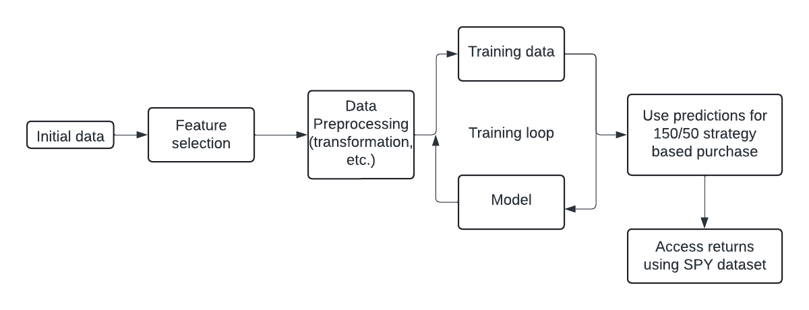
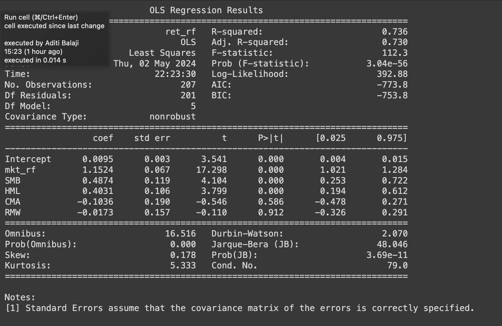
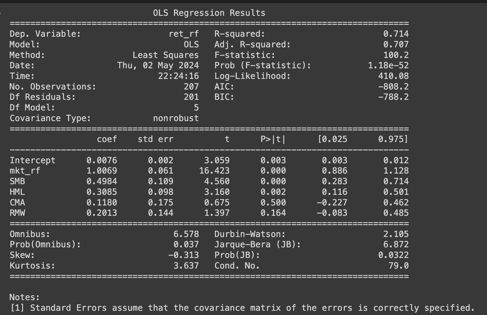
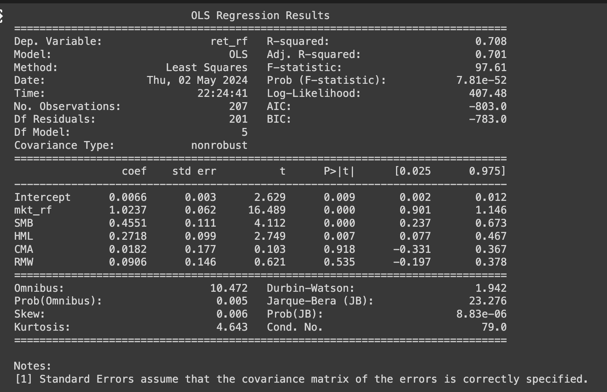

# Quantitative Investment Strategy

This project explores quantitative strategies for equity investment, specifically implementing and backtesting 150/50 (150% long, 50% short) strategies using historical data. It leverages financial features derived from academic literature and uses machine learning to guide portfolio construction.

---

## 🧠 Problem Statement

We implement and evaluate investment strategies based on predicted stock returns using features from Green, Hand, and Zhang (2017). Strategies are benchmarked against SPY and the Fama-French factors, and the best-performing strategy is identified for potential implementation.

---

## 📊 Dataset & Preprocessing

- **Source**: SQL server (`mssql-827920.cloudclusters.net:16272`)
- **Size**: 105+ features
- **Preprocessing Steps**:
  - **Quantile Transformation** (monthly)
  - **Industry Tagging** via `siccd` codes

---

## 🔍 Feature Selection

We used both financial theory and machine learning-based feature importance for selecting predictors. Key features include:

- `mom1m`, `mom12m`, `mom36m`: Momentum indicators over 1, 12, and 36 months
- `ret`: Historical return
- `sfe`, `rsup`, `ear`: Earnings and surprise factors
- `chmom`: Momentum change
- `idiovol`: Idiosyncratic volatility
- `siccd`: Industry classification

Feature selection analysis is documented in [`Feature_analysis.ipynb`](Feature_analysis.ipynb).

---

## 🤖 Modeling

We use the **CatBoost** algorithm due to its strong handling of categorical variables like industry codes and its robustness to noise, a key aspect in financial data.

---

## 📈 Strategies

Three strategies were tested:

| Strategy | Feature Used |
|----------|---------------|
| Strategy 1 | `mom1m` |
| Strategy 2 | `mom12m` |
| Strategy 3 | `mom36m` |

Implementation details are in:
- [`Strategy1.ipynb`](Strategy1.ipynb)
- [`strategy2.ipynb`](strategy2.ipynb)
- [`strategy3.ipynb`](strategy3.ipynb)

Performance:
- 
- 
- 

---

## 📑 Final Report

Detailed write-up of analysis and evaluation:  
[Finance_report.pdf](Finance_report.pdf)

---

## 📁 Project Structure
```text
├── Feature_analysis.ipynb
├── Finance_report.pdf
├── Process.png
├── README.md
├── Strategy1.ipynb
├── s1.png
├── s2.png
├── s3.png
├── siccodes12.csv
├── strategy2.ipynb
└── strategy3.ipynb
```

---

## 📚 Reference

Green, Jeremiah, John Hand, and X. Frank Zhang. "The supraview of firm fundamentals in the cross section of stock returns." *The Review of Accounting Studies* (2017).

---

## 📬 Contact

For questions or feedback, feel free to reach out via [GitHub Issues](https://github.com/Aditi-balaji-13/Financial_market_Analysis/issues).
